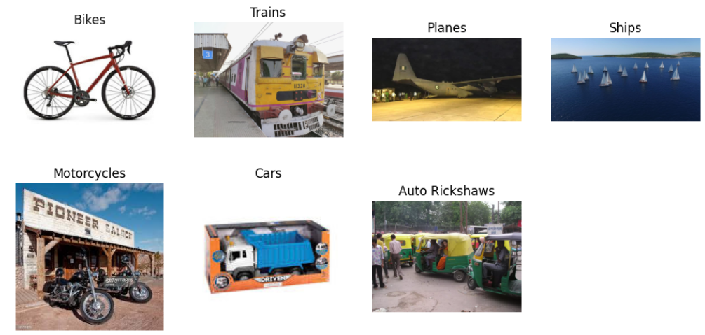
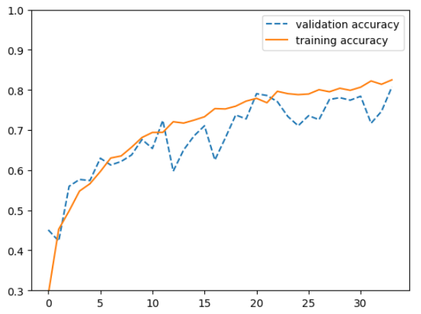
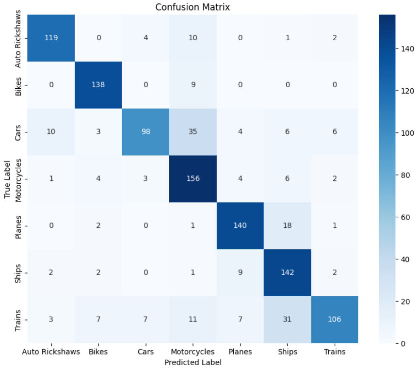
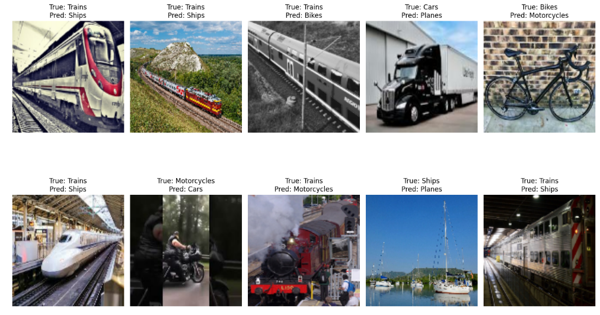

# 🚗 Классификация изображений транспортных средств с использованием CN

## 🎯 Цель работы

Цель данной лабораторной работы — разработка модели глубокого обучения на основе сверточной нейронной сети (CNN), которая классифицирует изображения различных транспортных средств на 7 категорий:

- 🚲 Велосипеды (Bikes)  
- 🚆 Поезда (Trains)  
- ✈️ Самолёты (Planes)  
- ⛵ Корабли (Ships)  
- 🏍️ Мотоциклы (Motorcycles)  
- 🚗 Машины (Cars)  
- 🛺 Авто-рикши (Auto Rickshaws)

---

## 📁 Описание датасета

Изображения были получены из открытого набора данных на Kaggle:

👉 **[Vehicle Classification Dataset on Kaggle](https://www.kaggle.com/datasets/mohamedmaher5/vehicle-classification)**

Каждая категория представлена папкой с соответствующими изображениями.  
Данные были равномерно распределены между обучающей и валидационной выборками.

### 📸 Примеры изображений из набора данных:

---

## 🧠 Архитектура модели CNN

Модель построена с использованием `tf.keras.Sequential` и включает:

- Слой нормализации (`Rescaling`)
- 4 блока: `Conv2D` → `MaxPooling2D`
- Слой `Flatten`
- Полносвязный слой на 512 нейронов + Dropout (0.2)
- Выходной слой Softmax (7 выходов)

---

## ⚙️ Параметры обучения

- Эпох: 100 (с досрочной остановкой при val_accuracy > 0.8)
- Оптимизатор: Adam
- Функция потерь: `categorical_crossentropy`
- Размер батча: 32
- Валидационная выборка: 20%

---

## 📈 Результаты обучения

### График точности по эпохам:

Модель достигла более 80% точности на обучающей и валидационной выборках, что свидетельствует о хорошей способности к обобщению.

---

## 📊 Матрица ошибок (Confusion Matrix)

Анализ матрицы ошибок показывает:
- Высокую точность для категорий **Мотоциклы**, **Самолёты**, **Велосипеды**
- Частые ошибки между **Поездами**, **Кораблями** и **Машинами**

---

## ❌ Примеры ошибок классификации

На следующих изображениях показаны примеры, где модель ошиблась:

Наиболее частые ошибки возникают в условиях плохого освещения, нестандартных углов, либо из-за схожести между классами (например, поезда и корабли).
